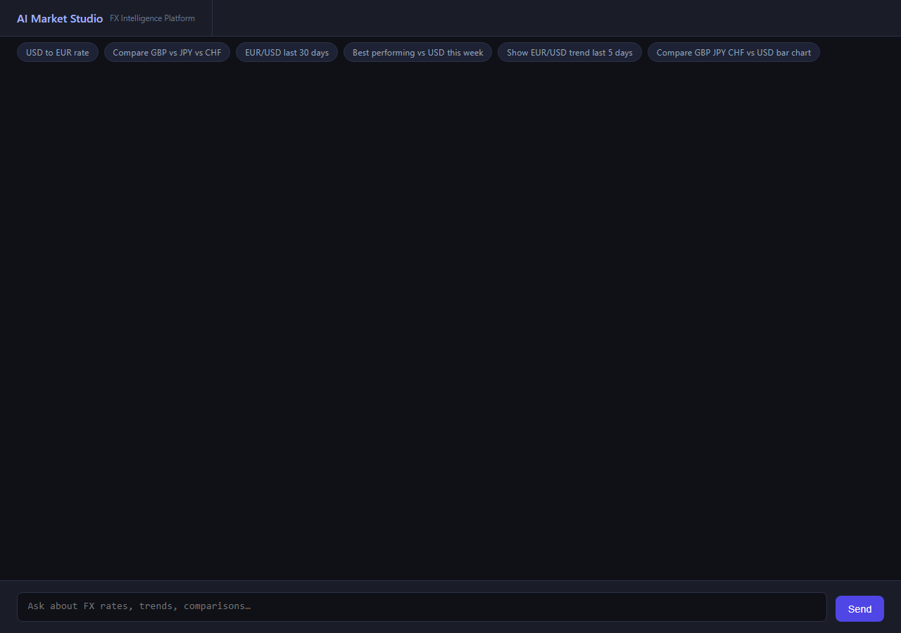
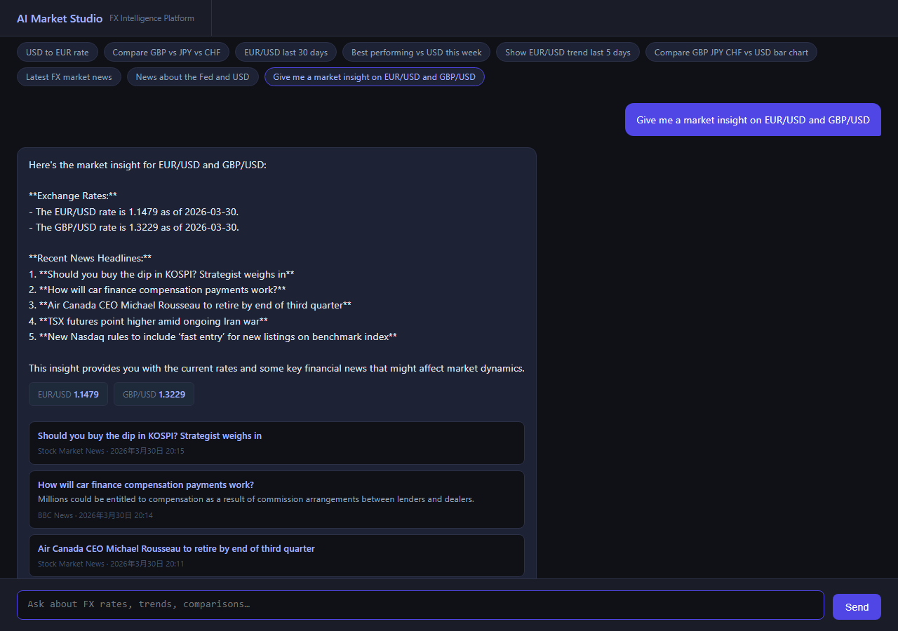

# AI Market Studio - Backend API

Backend API for the AI Market Studio conversational FX market data platform.

## Architecture

### Component Diagram


### Workflow Mode Playbook Sequence


This repository is part of a **microservices architecture** that was split from a monolithic application for better scalability and independent deployment:

- **Backend API / Agent Runtime**: This repository (FastAPI) - Port 8000
- **Frontend UI**: [ai-market-studio-ui](https://github.com/gjnzsu/ai-market-studio-ui) (Static HTML/JS + Chart.js) - Port 80
- **Kong Gateway for AI Traffic**: Kong OSS deployed independently in GKE; routes OpenAI-compatible `/v1` traffic to `ai-gateway-service`
- **AI Gateway Service**: [ai-gateway-service](https://github.com/gjnzsu/ai-gateway-service) (FastAPI + LiteLLM proxy) - Internal service
- **RAG Service**: [ai-rag-service](https://github.com/gjnzsu/ai-rag-service) (PDF/Jira/Confluence research ingestion and query) - Port 8000
- **AI SRE Observability**: [ai-sre-observability](https://github.com/gjnzsu/ai-sre-observability) (SDK ingest + Prometheus + Grafana) - Metrics collection

### Service Technology Stack

| Service | Repository / Manifests | Main Stack | Role |
|---|---|---|---|
| Frontend UI | [ai-market-studio-ui](https://github.com/gjnzsu/ai-market-studio-ui) | Static HTML/CSS/JavaScript, Chart.js, Nginx Alpine, Kubernetes LoadBalancer | Browser chat UI, predefined workflow prompts, inline charts, structured market briefing rendering, and PDF export trigger |
| Backend API / Agent Runtime | This repository | Python 3.12, FastAPI, Uvicorn, OpenAI SDK, Pydantic, httpx, reportlab, pytest | Workflow-only chat backend for `/api/chat`, rates/dashboard APIs, PDF export, GPT tool calling, financial playbooks, FRED grounding, and connector orchestration |
| Workflow and Playbook Layer | This repository (`backend/agent/`) | OpenAI function calling, typed workflow tools, runtime playbook registry, deterministic synthetic specialist data | Exposes `collect_market_context`, `analyze_market_context`, and `generate_market_briefing`; supports FX carry, macro rates, morning note, catalyst, and general briefing flows |
| Kong Gateway for AI Traffic | This repository (`k8s/kong-*.yaml`) | Kong Gateway OSS, Kubernetes Deployment/Service/ConfigMap | Independently deployed GKE gateway for OpenAI-compatible `/v1` traffic; receives backend LLM traffic and proxies to `ai-gateway-service` |
| AI Gateway Service | [ai-gateway-service](https://github.com/gjnzsu/ai-gateway-service) | Python, FastAPI, LiteLLM, httpx, YAML config, provider secrets | Centralized OpenAI/DeepSeek provider key ownership, model routing, and OpenAI-compatible chat-completions endpoint behind Kong |
| Connector Layer | This repository (`backend/connectors/`) | httpx, exchangerate.host/mock FX, RSS/live-with-mock-fallback news, FRED API, RAG client | Keeps tool/data traffic inside backend connectors; fetches FX rates, historical series, market news, FRED DFF/FEDFUNDS/DGS10, RAG research, and correlation inputs |
| RAG Service | [ai-rag-service](https://github.com/gjnzsu/ai-rag-service) | Python 3.12, FastAPI, OpenAI embeddings, ChromaDB, LangChain text splitters, PyMuPDF, Atlassian API | PDF/Jira/Confluence/FX research ingestion and document retrieval for market context and cited research reports |
| Observability Service | [ai-sre-observability](https://github.com/gjnzsu/ai-sre-observability) | Python 3.12, FastAPI, Prometheus client, Pydantic, custom SDK | Receives LLM telemetry from instrumented backend calls and exposes Prometheus metrics |
| Metrics Stack | [ai-sre-observability](https://github.com/gjnzsu/ai-sre-observability) Kubernetes manifests | Prometheus, Grafana, Redis | Scrapes observability metrics and visualizes LLM cost, usage, request performance, and service health |
| Deployment Platform | Service `k8s/` directories and `cloudbuild.yaml` files | GKE, Kubernetes, Cloud Build, Docker, GCR/Artifact Registry, ConfigMaps, Secrets | Builds, configures, and deploys frontend, backend, Kong, gateway, RAG, and observability services on Google Cloud |

### Why Microservices?

The original monolithic application was split to achieve:
- **Independent scaling**: Frontend and backend can scale separately based on load
- **Independent deployment**: Deploy API changes without affecting the UI
- **Technology flexibility**: Each service uses the best tool for its purpose
- **Better resource utilization**: Each service has its own resource limits and can be optimized independently

### Communication Flow

```text
User Browser
   |
   | HTTP (external)
   v
Frontend (ai-market-studio-ui) - nginx on port 80
   |
   | HTTP (external LoadBalancer IP)
   v
Backend API (this repo) - FastAPI on port 8000
   |
   |-- HTTP (internal) --> AI Gateway Service (LiteLLM proxy)
   |                          |
   |                          |-- OpenAI (gpt-5.4, gpt-4o, gpt-4o-mini)
   |                          `-- DeepSeek (deepseek-chat)
   |
   |-- HTTP (internal) --> AI SRE Observability Service
   |                          |
   |                          |-- Collects LLM metrics (tokens, cost, latency)
   |                          |-- Exposes Prometheus metrics endpoint
   |                          `-- Batches metrics every 5 seconds
   |
   `-- HTTP (internal Kubernetes DNS)
       v
   RAG Service (ai-rag-service) - FastAPI on port 8000

Observability Stack:
   AI SRE Observability Service
   |
   | /metrics endpoint (scrape every 15s)
   v
   Prometheus (metrics storage)
   |
   | PromQL queries
   v
   Grafana (visualization dashboards)
```

**Key Points:**
- Frontend → Backend: Uses external LoadBalancer IP (browser cannot access internal DNS)
- Backend → Kong Gateway: Uses internal Kubernetes DNS (`http://ai-gateway-kong.ai-gateway.svc.cluster.local/v1`); Kong then proxies to `ai-gateway-service`
- Backend → RAG Service: Uses the configured `RAG_SERVICE_URL` (`http://34.10.130.210` in the current ConfigMap; internal service DNS can be used when the RAG service is deployed in the same cluster/namespace)
- AI Gateway routes LLM requests to OpenAI or DeepSeek based on model name

> **Vision:** AI-native market intelligence platform for natural language-driven data retrieval, automated dashboard generation, and context-aware insights.



---

## Live Deployment

The application is deployed on Google Kubernetes Engine (GKE):

| Component | URL | Status | Replicas |
|-----------|-----|--------|----------|
| **Frontend UI** | http://136.116.205.168 | ✓ Running | 2 |
| **Backend API** | http://35.224.3.54 | ✓ Running | 1 |
| **API Docs** | http://35.224.3.54/docs | ✓ Available | - |
| **Kong Gateway for AI** | `http://ai-gateway-kong.ai-gateway.svc.cluster.local/v1` (internal) | ✓ Running | 2 |
| **RAG Service** | `http://34.10.130.210` (`RAG_SERVICE_URL`) | ✓ Running | 1 |
| **AI SRE Observability** | `http://ai-sre-observability:8080` (internal) | ✓ Running | 1 |
| **Prometheus** | http://136.113.33.154:9090 | ✓ Running | 1 |
| **Grafana** | http://136.114.77.0 | ✓ Running | 1 |

**GKE Cluster:** `helloworld-cluster` (us-central1)
**GCP Project:** `gen-lang-client-0896070179`

### Deployment Details

| Detail | Value |
|---|---|
| Backend Image | `gcr.io/gen-lang-client-0896070179/ai-market-studio:latest` |
| Frontend Image | `gcr.io/gen-lang-client-0896070179/ai-market-studio-ui:latest` |
| LLM Provider | AI Gateway Service (routes to OpenAI/DeepSeek) |
| LLM Model | `gpt-5.4` (configurable: `gpt-4o`, `gpt-4o-mini`, `deepseek-chat`) |
| FX Connector | `USE_MOCK_CONNECTOR=true` (set `false` for live exchangerate.host data) |
| News Connector | `USE_MOCK_NEWS_CONNECTOR=false` (live RSS feeds) |
| RAG Service URL | `http://34.10.130.210` (external deployed RAG endpoint) |
| Workflow Mode | `ENABLE_AGENT_WORKFLOW_MODE=true` |
| CORS Origins | `http://136.116.205.168` (frontend URL) |

## Features

### Feature 01 - FX Chat Assistant
- Natural-language queries: *"What is EUR/USD today?"*, *"Compare USD vs JPY and CHF"*
- GPT-5.4 function calling for FX rates, historical rates, dashboards, market news, and internal research
- **LLM routing via AI Gateway**: All OpenAI calls route through internal gateway service for centralized key management and multi-provider support
- Conversation history maintained client-side

### Feature 02 - FX Rate Historical Data
- `POST /api/rates/historical` - daily FX rates with in-memory LRU cache (TTL=300s)
- `POST /api/dashboard` - batch panel data fetch (up to 9 panels)
- Supports line trend, bar comparison, and stat summary panel types
- Toggle between live API and mock data via `USE_MOCK_CONNECTOR`

### Feature 03 - Market News
- Ask in natural language: *"What's the latest FX news?"*, *"Any news on EUR/USD?"*
- GPT-5.4 calls the `get_fx_news` tool; results render as inline news cards in the chat bubble
- Free RSS feeds (BBC Business, Investing.com FX, FXStreet); no paid news API key required
- Query filtering and item cap; fully decoupled from the rate connector via `USE_MOCK_NEWS_CONNECTOR`
- Mock news connector used in tests for deterministic output

### Feature 04 - Conversational Dashboard Generation
- Ask in natural language: *"Show me EUR/USD and GBP/USD trend for the last 5 days"*
- LLM detects chart/visualize/show intent and calls the `generate_dashboard` tool
- Inline Chart.js chart renders directly inside the chat bubble; no tab switching
- Supports line-trend and bar-comparison chart types


### Feature 05 - Research Report RAG Query
- Ask in natural language: *"Search internal research docs for deployment checklist"*, *"Find internal research about RAG ingestion"*
- GPT-5.4 calls the `get_internal_research` tool, which queries the external RAG service configured by `RAG_SERVICE_URL`
- `RAGConnector` normalizes service responses into `{type: "rag", answer, sources[]}` so the chat UI can render cited source names inline
- Source names are derived from `title` first, then `document_id`, while preserving source metadata such as `source_type`, `excerpt`, and `score`
- Research-report/PDF ingestion is handled by the external RAG service; this repo currently provides the query and citation UI layer

### Feature 06 - Export to PDF
- Ask a question that returns structured data (market insight, dashboard, news, or research), then click **Export to PDF**
- The button appears automatically below any assistant response that contains `insight`, `dashboard`, `news`, or `rag` data
- The backend renders a branded PDF via `reportlab` containing:
  - Report title, timestamp, and tool used
  - LLM reply/summary text
  - FX rates table (for insight responses)
  - Market news table (for insight and news responses)
  - Dashboard series table (for dashboard responses)
  - Source documents list (for RAG responses)
- **Endpoint:** `POST /api/export/pdf`
- **Request body:**
  ```json
  {
    "reply": "EUR/USD is trading at 1.0850...",
    "data": { "type": "market_briefing", "pairs": ["EUR/USD"], "context": {...} },
    "tool_used": "generate_market_briefing"
  }
  ```
- **Response:** Binary PDF file (`application/pdf`) with `Content-Disposition: attachment; filename="fx-insight-YYYYMMDD_HHMM.pdf"`
- **Testing:** Comprehensive E2E test suite in `backend/tests/e2e/test_pdf_export.py`
  - 8 test cases covering all data types (rates, insights, dashboard, news, RAG)
  - Tests verify PDF generation, content validation, file size, and error handling
  - Run tests: `pytest backend/tests/e2e/test_pdf_export.py -v`
  - Coverage: 93% of PDF exporter module

### Feature 07 - Market Insight Summary
- Ask in natural language: *"Give me a market insight on EUR/USD and GBP/USD"*
- Legacy mode answers market insight requests through the approved low-level market data tools.
- Workflow mode replaces the deprecated `generate_market_insight` tool with `generate_market_briefing`.
- Market briefings coordinate FX rates, news, FRED indicators, and internal research behind one intent-level workflow result.
- Responses keep the existing `reply`, `data`, and `tool_used` shape for frontend compatibility.



### Feature 08 - FRED Interest Rate Queries
- Ask in natural language: *"What is the current federal funds rate?"*, *"Show me the 10-Year Treasury rate"*, *"30-year mortgage rate"*
- GPT-5.4 calls `get_interest_rate` tool to fetch Federal Reserve Economic Data (FRED)
- Backend directly integrates FRED API via `backend/connectors/fred_connector.py`
- Common series: DFF (Federal Funds), T10Y2Y (Treasury Spread), DGS10 (10-Year), MORTGAGE30US, DTB3, DGS2, DGS5, T10Y3M
- Supports both current rates and optional historical date queries
- Error handling: timeout, missing data, and API errors all caught and reported
- Renders inline rate cards with source attribution (Federal Reserve Economic Data)
- **Live Deployment Status:** Deployed since 2026-04-12; FRED is configured through `FRED_API_KEY` in the backend Kubernetes Secret or local `.env`
- **Recent local E2E result:** Workflow-mode FX carry briefing fetched `DFF=3.62` and `DGS10=4.47` from FRED, both dated 2026-06-01

### Feature 09 - AI Gateway Integration (2026-04-13)
- **Centralized LLM Management**: All OpenAI API calls route through internal AI Gateway service
- **Multi-Provider Support**: Seamless routing to OpenAI (gpt-4o, gpt-4o-mini) or DeepSeek (deepseek-chat)
- **Dynamic Model Selection**: Switch models via ConfigMap without code changes
- **Cost Optimization**: Route queries to cost-effective models (gpt-4o-mini, deepseek-chat) based on complexity
- **Centralized LLM Key Management**: OpenAI/DeepSeek provider keys are managed by the gateway; non-LLM connector keys such as FRED stay with the backend
- **Single Observability Point**: All LLM requests logged and monitored at gateway level
- **Architecture**: Backend → Kong Gateway (ClusterIP) → AI Gateway Service → OpenAI/DeepSeek
- **Gateway Endpoint**: `http://ai-gateway-kong.ai-gateway.svc.cluster.local/v1` (internal)
- **Available Models**: `gpt-4o` (default), `gpt-4o-mini`, `deepseek-chat`
- **Model Switching**: Update `OPENAI_MODEL` in ConfigMap, rolling restart deployment
- **Rollback**: Easy revert to direct OpenAI calls via ConfigMap change

### Feature 10 - AI SRE Observability (2026-04-23)
- **Real-time LLM Cost Tracking**: Automatic tracking of token usage and costs for every user query
- **Prometheus Metrics**: Exposes `llm_requests_total`, `llm_tokens_total`, `llm_token_cost_usd_total` metrics
- **Grafana Dashboards**: Pre-built dashboards for LLM Cost & Usage, Service Overview, and Request Tracing
- **Token Accumulation**: Tracks prompt + completion tokens across multi-round agent conversations
- **Cost Calculation**: Automatic cost calculation based on model pricing (gpt-4o: $5/$15 per 1M tokens)
- **Graceful Degradation**: SDK continues working even if observability service is unavailable
- **Performance**: <10ms overhead per conversation, non-blocking async metrics submission
- **Architecture**: Backend SDK → Observability Service → Prometheus → Grafana
- **Observability Endpoint**: `http://ai-sre-observability.default.svc.cluster.local:8080` (internal)
- **Metrics Endpoint**: `http://ai-sre-observability:8080/metrics` (Prometheus scrape target)
- **Grafana URL**: http://136.114.77.0 (external access for dashboards)
- **Average Cost per Query**: ~$0.0072 USD (based on gpt-4o usage patterns)
- **Regression Tests**: 5 E2E tests in `backend/tests/e2e/test_observability.py` (97% coverage)

### Feature 11 - Agent Workflow Foundation (2026-05-21)
- **Mode selection**: `/api/chat` is workflow-only; omitted `agent_mode` defaults to `"workflow"`, and `"legacy"` is rejected.
- **Intent-level tools**: Workflow mode exposes `collect_market_context`, `analyze_market_context`, and `generate_market_briefing` instead of low-level internal agent tools.
- **Market insight replacement**: `generate_market_insight` is no longer an approved model-facing tool; market insight, overview, briefing, and synthesis requests use `generate_market_briefing` in workflow mode.
- **Guardrails**: Workflow requests have bounded runtime (`AGENT_WORKFLOW_TIMEOUT_SECONDS`) and bounded model/tool rounds (`AGENT_WORKFLOW_MAX_ROUNDS`).
- **Failure behavior**: Workflow failures return clear timeout or failure responses and do not silently fall back to legacy orchestration.
- **Observability**: Workflow logs include selected mode, workflow name, internal units, latency, status, and failure category.
- **Backward compatibility**: Existing clients can omit `agent_mode` and still receive the same `reply`, `data`, and `tool_used` response shape; only legacy-mode selection is removed.

### Feature 12 - Financial Analysis Playbooks (2026-06-02)
- **Runtime playbooks**: Workflow-mode market briefings can apply professional analysis frames for `general`, `fx_carry`, `macro_rates`, `morning_note`, and `catalyst_calendar`.
- **Explicit or inferred selection**: `generate_market_briefing` accepts an optional `playbook` field and can infer a playbook from briefing focus text when omitted.
- **Source grounding**: Briefing data includes selected playbook metadata, available/requested sources, missing required/optional sources, and specialist `data_gaps`.
- **Synthetic FX carry demo metrics**: The `fx_carry` playbook includes deterministic synthetic forward curve and implied-volatility assumptions for demo/test carry metrics; these are labeled as synthetic and are not live market quotes.
- **Current data surface**: Playbooks ground themselves in existing FX rates, FRED indicators, market news, and internal research/RAG sources.
- **Research-only boundary**: Playbook outputs support market research and desk briefing workflows; they do not provide live execution instructions, broker routing, or automated trading advice.

### Feature 13 - Playbook Runtime Primitives (2026-06-08)
- **Primitive composition**: Backend playbooks are represented as composed runtime definitions: identity, source contract, output contract, runtime profile, and rule metadata.
- **Developer extensibility**: New playbooks can be added through focused definitions while preserving existing registry helpers such as `list_playbooks`, `get_playbook`, and `select_playbook`.
- **Deterministic profiles**: The FX carry synthetic specialist layer is expressed through a `demo_synthetic_fx` runtime profile so demo/test behavior remains explicit and stable.
- **Rule metadata**: Source grounding, data-gap reporting, synthetic source disclosure, and research-only framing are named runtime rules rather than implicit workflow assumptions.
- **No API breakage**: `/api/chat` workflow responses keep the existing `playbook`, `source_grounding`, `data_gaps`, `specialist_data`, and `carry_metrics` shape.

---

## Architecture

```text
User Browser
   |
   | HTTP (external: http://136.116.205.168)
   v
Frontend (ai-market-studio-ui) - nginx on port 80
   |
   | HTTP POST (external: http://35.224.3.54/api/*)
   v
Backend API (this repo - FastAPI) on port 8000
   |
   |-- /api/chat              -> configurable GPT agent loop
   |-- /api/rates/historical  -> daily FX rates, LRU cached
   |-- /api/dashboard         -> batch panel fetch
   |-- /api/export/pdf        -> PDF report generation (reportlab via backend/exporters/pdf_exporter.py)
   |
   v
Kong Gateway - http://ai-gateway-kong.ai-gateway.svc.cluster.local/v1
   |
   v
AI Gateway Service (LiteLLM) - http://ai-gateway.ai-gateway.svc.cluster.local
   |
   |-- OpenAI (gpt-5.4, gpt-4o, gpt-4o-mini)
   `-- DeepSeek (deepseek-chat)

Backend also connects to:
   |
   |-- AI SRE Observability Service (metrics collection)
   |      |
   |      | POST /ingest (batched every 5s)
   |      v
   |   Observability Service - http://ai-sre-observability:8080
   |      |
   |      | GET /metrics (Prometheus scrape)
   |      v
   |   Prometheus - http://prometheus-service:9090
   |      |
   |      | PromQL queries
   |      v
   |   Grafana - http://136.114.77.0
   |
   v
Connector Layer
   |-- ExchangeRateHostConnector -> live FX data (exchangerate.host)
   |-- MockConnector             -> deterministic synthetic FX data
   |-- RSSNewsConnector          -> free RSS feeds
   |-- MockNewsConnector         -> deterministic synthetic news
   |-- FREDConnector             -> Federal Reserve interest rates (direct FRED API)
   `-- RAGConnector              -> external RAG service
                                    |
                                    | HTTP (configured by RAG_SERVICE_URL)
                                    v
                                 RAG Service (ai-rag-service)
```

**Legacy-mode GPT-5.4 tools:** `get_exchange_rate`, `get_exchange_rates`, `get_historical_rates`, `list_supported_currencies`, `get_interest_rate`, `analyze_fx_economic_correlation`, `generate_dashboard`, `get_fx_news`, `get_internal_research`

**Workflow-mode GPT-5.4 tools:** `collect_market_context`, `analyze_market_context`, `generate_market_briefing`

`generate_market_briefing` supports optional financial analysis playbooks: `general`, `fx_carry`, `macro_rates`, `morning_note`, and `catalyst_calendar`.

---

## API Endpoints

### Chat Endpoint

**POST** `/api/chat`

Main conversational interface with GPT-5.4 agent. Requests use workflow orchestration by default; `agent_mode` may be omitted or set to `"workflow"`. Legacy mode is no longer supported.

**Request:**
```json
{
  "message": "What is the EUR/USD rate?",
  "history": [],
  "agent_mode": "workflow"
}
```

**Response:**
```json
{
  "reply": "The EUR/USD rate is 1.0868 as of 2026-04-03.",
  "data": {
    "base": "EUR",
    "target": "USD",
    "rate": 1.086838,
    "date": "2026-04-03",
    "source": "mock"
  },
  "tool_used": "get_exchange_rate"
}
```

**Workflow-mode request:**
```json
{
  "message": "Brief EUR/USD with news and research context",
  "history": [],
  "agent_mode": "workflow"
}
```

Workflow mode returns the same top-level response fields. A successful market briefing reports `tool_used` as `generate_market_briefing` and carries structured workflow data inside `data`.

### Historical Rates Endpoint

**POST** `/api/rates/historical`

Fetch daily FX rates with LRU caching (TTL=300s).

**Request:**
```json
{
  "base": "EUR",
  "target": "USD",
  "start_date": "2026-03-28",
  "end_date": "2026-04-03"
}
```

### Dashboard Endpoint

**POST** `/api/dashboard`

Batch panel data fetch (up to 9 panels).

**Request:**
```json
{
  "panels": [
    {
      "type": "line-trend",
      "base": "EUR",
      "target": "USD",
      "days": 7
    }
  ]
}
```

### Export to PDF

**POST** `/api/export/pdf`

Render a chat response as a downloadable PDF. Accepts the current reply text and structured data from the agent.

**Request:**
```json
{
  "reply": "EUR/USD is trading at 1.0850, up 0.3% on the day.",
  "data": {
    "type": "market_briefing",
    "pairs": ["EUR/USD"],
    "context": {
      "rates": [{"base": "EUR", "target": "USD", "rate": 1.085}],
      "news": [{"title": "Fed signals pause", "source": "FXStreet"}]
    }
  },
  "tool_used": "generate_market_briefing"
}
```

**Response:** Binary PDF file (`Content-Type: application/pdf`).

**Try it from the UI:** Ask for a market insight on EUR/USD, then click **Export to PDF** below the response.

### Health Check

**GET** `/docs`

OpenAPI documentation and health check endpoint.

---

## Deployment Snapshot

The live GKE deployment is summarized near the top of this README. Current backend configuration is driven by:

- `k8s/configmap.yaml` for non-secret runtime settings such as connector mode, AI Gateway URL, RAG URL, and workflow flags.
- `k8s/secret.yaml.template` for required secret names; do not commit real API keys.

At the time of this README update, the backend service is externally reachable at `http://35.224.3.54`, the frontend at `http://136.116.205.168`, and workflow mode is enabled in the ConfigMap.

---

## Quick Start

### Prerequisites
- Python 3.12+
- An [OpenAI API key](https://platform.openai.com/)
- An [exchangerate.host API key](https://exchangerate.host/) if you want live FX data
- A [FRED API key](https://fred.stlouisfed.org/docs/api/api_key.html) if you want FRED interest-rate data
- Access to a deployed RAG service that supports `POST /query` with `{"question": "..."}`

### 1. Clone and install

```bash
git clone https://github.com/gjnzsu/ai-market-studio.git
cd ai-market-studio
pip install -r backend/requirements.txt   # all deps (dev + test + runtime)

# For production-only deps (smaller image, faster deploy):
pip install -r backend/runtime.txt
```

### 2. Configure environment

Create a `.env` file in the repo root:

```env
OPENAI_API_KEY=<your-openai-api-key>
OPENAI_BASE_URL=https://api.openai.com/v1
OPENAI_MODEL=gpt-5.4
EXCHANGERATE_API_KEY=your_key_here
FRED_API_KEY=your_fred_api_key
USE_MOCK_CONNECTOR=true
USE_MOCK_NEWS_CONNECTOR=false
RAG_SERVICE_URL=http://34.10.130.210
ENABLE_AGENT_WORKFLOW_MODE=true
AGENT_WORKFLOW_TIMEOUT_SECONDS=60
AGENT_WORKFLOW_MAX_ROUNDS=2
```

> **Note:** In GKE deployment, `OPENAI_BASE_URL` points to Kong in front of the AI Gateway service (`http://ai-gateway-kong.ai-gateway.svc.cluster.local/v1`). For local development, use the default OpenAI endpoint or run the gateway locally.

> The exchangerate.host free tier has a low request quota. Keep `USE_MOCK_CONNECTOR=true` during development unless you specifically need live FX data.

### 3. Start the backend API

```bash
uvicorn backend.main:app --host 0.0.0.0 --port 8000
```

The API will be available at [http://localhost:8000](http://localhost:8000).

### 4. Start the frontend (separate repo)

Clone and run the frontend:

```bash
git clone https://github.com/gjnzsu/ai-market-studio-ui.git
cd ai-market-studio-ui
# Update API_BASE_URL in env-config.html if needed (default: http://localhost:8000)
python -m http.server 8080
```

Open [http://localhost:8080](http://localhost:8080) in your browser.

> **Note:** The frontend UI is in a separate repository. See [ai-market-studio-ui](https://github.com/gjnzsu/ai-market-studio-ui) for frontend setup and deployment instructions.

### 5. Test RAG from the UI

Try prompts such as:

```text
Search internal research docs for deployment checklist
Find internal research about RAG ingestion
```

If the RAG tool is selected, the assistant response should include a **Sources** block listing matched documents.

---

## RAG Service Integration

### Query flow
1. The user asks a research-document question in `/api/chat`.
2. GPT-4o selects `get_internal_research`.
3. `backend/connectors/rag_connector.py` sends `POST {RAG_SERVICE_URL}/query` with `{"question": "..."}`.
4. The connector normalizes the service response to `type="rag"`, `answer`, and `sources[].name`.
5. `frontend/index.html` renders the answer and source list in the assistant chat bubble.

### Research report ingestion
- Ingest PDFs/research reports into the external RAG service before querying from AI Market Studio.
- In the current GCP setup, the app points to the deployed RAG endpoint at `http://34.10.130.210`.
- Use `scripts/ingest_research_reports.py` for local batch upload of PDF research reports to `POST {RAG_SERVICE_URL}/ingest/pdf`.
- First-party PDF upload/ingestion UI is not yet exposed in this repository; ingestion storage and indexing are still owned by the external RAG service.

```powershell
$env:RAG_SERVICE_URL="http://localhost:8000"
python scripts/ingest_research_reports.py "C:\path\to\research-reports" --recursive --dry-run
```

---

## Deploy to GKE

### 1. Build and push the image

```bash
gcloud auth configure-docker

# Normal deploy (code-only changes) — uses Docker layer cache, ~1-2 sec
docker build -t gcr.io/<PROJECT_ID>/ai-market-studio:latest .
docker push gcr.io/<PROJECT_ID>/ai-market-studio:latest

# Force clean pip reinstall (only when adding new dependencies)
docker build --no-cache -t gcr.io/<PROJECT_ID>/ai-market-studio:latest .
```

### 2. Get cluster credentials

```bash
gcloud container clusters get-credentials <CLUSTER_NAME> --region <REGION> --project <PROJECT_ID>
```

### 3. Create the Kubernetes secret

```bash
kubectl create secret generic ai-market-studio-secrets \
  --from-literal=OPENAI_API_KEY=<your-openai-key> \
  --from-literal=EXCHANGERATE_API_KEY=<your-key-or-dummy> \
  --from-literal=FRED_API_KEY=<your-fred-api-key> \
  --dry-run=client -o yaml | kubectl apply -f -
```

When the backend uses AI Gateway, `OPENAI_API_KEY` in `ai-market-studio-secrets` may be a dummy value because the gateway owns the real LLM provider keys. `FRED_API_KEY` and `EXCHANGERATE_API_KEY` are consumed directly by this backend service.

### 4. Configure RAG endpoint

Update `k8s/configmap.yaml`:

```yaml
RAG_SERVICE_URL: "http://34.10.130.210"
```

### 5. Apply manifests and restart the deployment

```bash
kubectl apply -f k8s/configmap.yaml
kubectl apply -f k8s/kong-config.yaml
kubectl apply -f k8s/kong-deployment.yaml
kubectl apply -f k8s/kong-service.yaml
kubectl apply -f k8s/deployment.yaml
kubectl apply -f k8s/service.yaml
kubectl rollout restart deployment/ai-market-studio
kubectl rollout status deployment/ai-market-studio --timeout=300s
```

### 6. Get the external IP

```bash
kubectl get service ai-market-studio -o wide
```

---

## Configuration

| Variable | Default | Description |
|---|---|---|
| `OPENAI_API_KEY` | required | OpenAI API key for direct OpenAI use, or a dummy value when routing through AI Gateway |
| `OPENAI_BASE_URL` | `https://api.openai.com/v1` | OpenAI API base URL (set to Kong gateway URL in GKE: `http://ai-gateway-kong.ai-gateway.svc.cluster.local/v1`) |
| `OPENAI_MODEL` | `gpt-5.4` | Model used by the agent (options: `gpt-5.4`, `gpt-4o`, `gpt-4o-mini`, `deepseek-chat`) |
| `EXCHANGERATE_API_KEY` | required | exchangerate.host API key |
| `FRED_API_KEY` | optional | FRED API key. Required for `get_interest_rate`, FRED-backed market briefings, and FX carry/macro playbooks that require FRED data |
| `USE_MOCK_CONNECTOR` | `false` | Use synthetic FX data instead of live exchangerate.host API |
| `USE_MOCK_NEWS_CONNECTOR` | `false` | Use synthetic news data instead of live RSS feeds |
| `RAG_SERVICE_URL` | `http://localhost:8000` | Base URL of the external RAG service; `RAGConnector` calls `POST {RAG_SERVICE_URL}/query` |
| `ENABLE_AGENT_WORKFLOW_MODE` | `false` | Enables workflow-only `/api/chat`; when disabled, chat returns 403, and legacy mode remains unsupported |
| `AGENT_WORKFLOW_TIMEOUT_SECONDS` | `20.0` | Timeout for workflow-mode chat requests |
| `AGENT_WORKFLOW_MAX_ROUNDS` | `2` | Maximum LLM/tool rounds for workflow-mode requests |
| `OBSERVABILITY_URL` | `http://ai-sre-observability.default.svc.cluster.local:8080` | AI SRE Observability service endpoint for LLM metrics collection |
| `MAX_HISTORICAL_DAYS` | `7` | Max date range per dashboard request |
| `CORS_ORIGINS` | `*` | Comma-separated allowed origins |

---

## Running Tests

```bash
# Unit and E2E API tests
python -m pytest backend/tests/ -v

# RAG connector + chat integration tests
python -m pytest backend/tests/unit/test_rag_connector.py backend/tests/e2e/test_rag_integration.py -q

# Playwright end-to-end test (requires server running on :8000)
python test_dashboard.py
```

> Most automated tests use `MockConnector` or mocked RAG HTTP responses so they do not consume external API quota.

---

## AI Gateway Integration

### Overview

All LLM requests from the backend now route through the **AI Gateway Service**, a centralized LiteLLM proxy that provides:

- **Unified API**: OpenAI-compatible `/v1/chat/completions` endpoint
- **Multi-provider routing**: Automatic routing to OpenAI or DeepSeek based on model name
- **Centralized LLM key management**: OpenAI/DeepSeek provider keys are stored in gateway secrets; this backend still owns non-LLM connector keys such as FRED and exchangerate.host
- **Cost optimization**: Easy switching between models (gpt-4o, gpt-4o-mini, deepseek-chat)
- **Single observability point**: All LLM requests logged at gateway level

### Architecture

```text
Backend (ai-market-studio)
   |
   | AsyncOpenAI(base_url=OPENAI_BASE_URL)
   v
Kong Gateway (ai-gateway-kong.ai-gateway.svc.cluster.local/v1)
   |
   v
AI Gateway Service (ai-gateway.ai-gateway.svc.cluster.local)
   |
   |-- model=gpt-5.4       --> OpenAI API
   |-- model=gpt-4o       --> OpenAI API
   |-- model=gpt-4o-mini  --> OpenAI API
   `-- model=deepseek-chat --> DeepSeek API
```

### Configuration

**Backend Configuration** (`backend/config.py`):
```python
openai_api_key: SecretStr           # Dummy value in GKE (gateway manages real keys)
openai_base_url: str = "https://api.openai.com/v1"  # Overridden in GKE
openai_model: str = "gpt-4o"        # Configurable via ConfigMap
```

**Kubernetes ConfigMap** (`k8s/configmap.yaml`):
```yaml
OPENAI_BASE_URL: "http://ai-gateway-kong.ai-gateway.svc.cluster.local/v1"
OPENAI_MODEL: "gpt-5.4"  # Change to gpt-4o, gpt-4o-mini, or deepseek-chat
```

**Kubernetes Secret** (`k8s/secret.yaml`):
```yaml
OPENAI_API_KEY: "dummy"  # Real LLM provider keys are managed by AI Gateway
```

### Switching Models

To switch between models, update the ConfigMap and restart the deployment:

```bash
# Switch to gpt-4o-mini (faster, cheaper)
kubectl patch configmap ai-market-studio-config \
  --patch '{"data":{"OPENAI_MODEL":"gpt-4o-mini"}}'

# Switch to deepseek-chat (cost-effective for reasoning tasks)
kubectl patch configmap ai-market-studio-config \
  --patch '{"data":{"OPENAI_MODEL":"deepseek-chat"}}'

# Switch back to gpt-4o (default)
kubectl patch configmap ai-market-studio-config \
  --patch '{"data":{"OPENAI_MODEL":"gpt-4o"}}'

# Apply changes (rolling restart)
kubectl rollout restart deployment/ai-market-studio
kubectl rollout status deployment/ai-market-studio
```

### Available Models

| Model | Provider | Use Case | Cost |
|-------|----------|----------|------|
| `gpt-5.4` | OpenAI | Latest frontier model with enhanced reasoning and coding (default) | $$$$ |
| `gpt-4o` | OpenAI | High-capability general purpose | $$$ |
| `gpt-4o-mini` | OpenAI | Fast, cost-effective tasks | $ |
| `deepseek-chat` | DeepSeek | Reasoning-heavy workloads, cost savings | $$ |

### Rollback to Direct OpenAI

If needed, revert to direct OpenAI calls:

```bash
# Update ConfigMap to point to OpenAI directly
kubectl patch configmap ai-market-studio-config \
  --patch '{"data":{"OPENAI_BASE_URL":"https://api.openai.com/v1"}}'

# Update Secret with real OpenAI API key
kubectl patch secret ai-market-studio-secrets \
  --patch '{"stringData":{"OPENAI_API_KEY":"<your-openai-api-key>"}}'

# Rolling restart
kubectl rollout restart deployment/ai-market-studio
```

### Verification

**Check backend logs:**
```bash
kubectl logs -l app=ai-market-studio --tail=50
```

Look for: `INFO: AI Market Studio started.` with no OpenAI authentication errors.

**Check gateway logs:**
```bash
kubectl -n ai-gateway logs -l app=ai-gateway --tail=50
```

Look for: `POST /v1/chat/completions` requests with `200 OK` responses.

**Test chat endpoint:**
```bash
curl -X POST http://35.224.3.54/api/chat \
  -H "Content-Type: application/json" \
  -d '{"message": "What is the EUR/USD rate?", "history": []}'
```

Expected: Valid JSON response with `reply`, `data`, and `tool_used` fields.

### Implementation Details

**Files Modified:**
- `backend/config.py` - Added `openai_base_url` field
- `backend/agent/agent.py` - Pass `base_url` to `AsyncOpenAI` client
- `k8s/configmap.yaml` - Added `OPENAI_BASE_URL` pointing to gateway
- `k8s/secret.yaml` - Changed to dummy `OPENAI_API_KEY`
- `backend/tests/e2e/test_gateway_integration.py` - E2E tests for gateway integration

**Commits:**
- `a3e39a9` - Backend config with openai_base_url field
- `468f4ec` - Agent client using configurable base_url
- `e3888ef` - ConfigMap with gateway endpoint
- `d923dfb` - Secret template for security
- `bae0f92` - E2E tests for gateway integration
- `fb4fbe5` - Final summary commit

### Related Repository

- **AI Gateway Service**: [ai-gateway-service](https://github.com/gjnzsu/ai-gateway-service)

---

## MCP Integration & FRED Connector Testing

### Architecture Decision: Direct API vs MCP

**Rationale:** Backend now calls FRED API directly via `httpx` instead of via MCP subprocess.

**Why?**
- **Simpler deployment:** One less GKE service to operate
- **Lower latency:** No subprocess overhead or IPC serialization
- **Better error handling:** Synchronous error handling in FastAPI context
- **No extra dependencies:** MCP subprocess would require service discovery, health checks, and failure modes

### Reference Implementation

The `ai-mcp-server` repository remains as a **working MCP protocol reference** (not deployed to GKE).

**Use case:** If workflows become complex (e.g., multiple data providers, tool composition), the reference implementation shows how to convert them to MCP servers.

### FRED Connector Testing

**Connector:** `backend/connectors/fred_connector.py`

**Methods:**
```python
FREDConnector.get_current_rate(series_id: str, date?: str) → InterestRateData
FREDConnector.get_historical_rates(series_id: str, start_date: str, end_date: str) → HistoricalRatesData
FREDConnector.list_fred_series() → dict[str, str]
```

**Common Series:**
- `DFF` — Effective Federal Funds Rate (daily)
- `T10Y2Y` — 10-Year minus 2-Year Treasury Spread
- `DGS10` — 10-Year Treasury Constant Maturity Rate
- `DGS2` — 2-Year Treasury Constant Maturity Rate
- `MORTGAGE30US` — 30-Year Fixed Rate Mortgage Average

**Test the connector locally:**
```python
import asyncio
from backend.connectors.fred_connector import FREDConnector

connector = FREDConnector(api_key="<your-fred-api-key>")

# Current federal funds rate
rate = await connector.get_current_rate("DFF")
print(rate)

# 10-year treasury for last 30 days
historical = await connector.get_historical_rates(
    "DGS10",
    start_date="2026-03-13",
    end_date="2026-04-12"
)
print(historical)
```

**API Endpoint (via chat tool):**
```bash
# Ask the agent
curl -X POST http://localhost:8000/api/chat \
  -H "Content-Type: application/json" \
  -d '{"message": "What is the current federal funds rate?", "history": []}'
```

The agent will call `get_interest_rate`, which invokes the FRED connector and returns formatted rate data.

### Deployment Checklist

- [x] FRED connector implemented and tested locally
- [x] FRED API key injected through `ai-market-studio-secrets` (Kubernetes Secret)
- [x] Router endpoints wired to connector
- [x] Agent tools updated to call `get_interest_rate`
- [x] E2E chat workflow verified with live FRED API (`DFF` and `DGS10`)
- [ ] Add FRED rates to dashboard panels (future feature)

### Future: MCP Server Integration

If you need to integrate additional data providers (e.g., Bloomberg, Refinitiv) or create a tool composition layer, follow this pattern:

1. **Write an MCP server** (e.g., `ai-mcp-server` or a new `ai-mcp-market-data`)
2. **Test it standalone** with `mcp-server-test` or raw stdio
3. **Integrate as subprocess** in backend via `subprocess.Popen`
4. **Add health checks** and error handling for subprocess lifecycle
5. **Monitor latency** and consider caching layers

See `ai-mcp-server/app.py` for the reference stdio MCP implementation.

---

## Project Structure

```text
ai-market-studio/ (Backend API)
|-- backend/
|   |-- main.py
|   |-- router.py
|   |-- models.py
|   |-- config.py
|   |-- cache.py
|   |-- runtime.txt           # production-only dependencies (no test deps)
|   |-- requirements.txt       # all dependencies (dev + test + runtime)
|   |-- agent/
|   |   |-- agent.py
|   |   |-- tools.py
|   |   |-- workflows.py
|   |   `-- financial_playbooks.py
|   |-- agents/                # sub-agent helpers for collection, analysis, synthesis, reports
|   |-- connectors/
|   |   |-- base.py
|   |   |-- correlation_connector.py
|   |   |-- exchangerate_host.py
|   |   |-- fred_connector.py
|   |   |-- mock_connector.py
|   |   |-- news_connector.py
|   |   `-- rag_connector.py
|   |-- exporters/
|   |   `-- pdf_exporter.py     # PDF generation via reportlab
|   `-- tests/
|       |-- unit/
|       |-- agent/
|       `-- e2e/
|-- docs/
|-- k8s/
|-- openspec/
|-- Dockerfile              # multi-stage build (builder + production stages)
`-- .env
```

**Related Repositories:**
- Frontend: [ai-market-studio-ui](https://github.com/gjnzsu/ai-market-studio-ui)
- RAG Service: [ai-rag-service](https://github.com/gjnzsu/ai-rag-service)

---

## Roadmap

| Priority | Theme | Features | Status |
|---|---|---|---|
| P0 - Done | Foundation | Chat assistant, spot and historical FX rates, conversational dashboard, market news, GKE deployment, market insight summary | ✅ Complete |
| P1 - Done | Market Intelligence | Market insight summary (Feature 07) and market news (Feature 03) | ✅ Complete |
| P2 - Done | Output Generation | PDF report generation via Export to PDF button, email delivery pending | ✅ Complete |
| P3 - Done | Intelligence & Economic Data | RAG research integration (Feature 05), FRED interest rates (Feature 08), economic indicator queries | ✅ Complete |
| P4 - Done | Data Breadth & Observability | Direct FRED connector, AI Gateway service (OpenAI + DeepSeek), AI SRE Observability (LLM cost tracking) | ✅ Complete |
| P5 - Done | Agent Workflow Foundation | Opt-in workflow mode, intent-level market workflows, workflow guardrails, archived OpenSpec specs | ✅ Complete |
| P6 - In Progress | Platform & Simulation | Financial analysis playbooks implemented for workflow-mode briefings; custom agent creation, OCR/document ingestion for scanned PDFs, and paper-trading simulation remain future work | 🔄 In Progress |
| P7 - Planned | Execution & Risk | Broker connectivity, pre-trade risk checks, account permissions, audit logs, kill switch controls | 🔄 Planned |

**Note:** Feature 11 is an internal workflow foundation, not user-facing custom agent creation. Future custom agent work should build on the opt-in workflow mode rather than exposing low-level internal agent tools directly.

### Completed in P3/P4 (Phase 2026-04-12)

✅ **Feature 08 - FRED Interest Rates** (Deployed 2026-04-12)
- Connector: `backend/connectors/fred_connector.py` (direct HTTP to Federal Reserve API)
- Tool: `get_interest_rate` (GPT-4o function calling)
- Supported series: DFF (Federal Funds), T10Y2Y (10Y-2Y Spread), DGS10 (10-Year), DGS2 (2-Year), DGS5 (5-Year), DTB3 (3-Month), MORTGAGE30US (30Y Mortgage), T10Y3M (10Y-3M Spread)
- Dispatch handler: `backend/agent/tools.py` lines 381-389
- Agent awareness: SYSTEM_PROMPT updated with FRED guidance (backend/agent/agent.py line 29)
- Testing: 2 unit tests added (test_dispatch_get_interest_rate + error handling), 0 regressions
- Recent local E2E: workflow-mode `/api/chat` FX carry briefing fetched `DFF=3.62` and `DGS10=4.47` from FRED, both dated 2026-06-01

✅ **P3 - RAG Integration** (Feature 05, 2026-04-04)
- External RAG service integration via `RAGConnector`
- Citation/source rendering in chat UI
- Deduplication at backend layer

✅ **P4 - AI Gateway Integration** (2026-04-13)
- Centralized LLM management via AI Gateway service
- Multi-provider routing: OpenAI (gpt-4o, gpt-4o-mini) and DeepSeek (deepseek-chat)
- Dynamic model selection via ConfigMap without code changes
- Centralized LLM key management through the gateway; backend-owned data connector keys remain in backend secrets
- Single observability point for all LLM requests
- Cost optimization through model selection
- GKE deployment: `ai-gateway` namespace, 2 replicas
- Backend integration: `OPENAI_BASE_URL=http://ai-gateway-kong.ai-gateway.svc.cluster.local/v1`
- Verified working: All features tested through gateway (chat, dashboard, news, RAG, PDF)
- Model switching tested: gpt-4o, gpt-4o-mini, deepseek-chat all operational

✅ **P4 - AI SRE Observability Integration** (2026-04-23)
- Real-time LLM cost tracking via observability SDK
- Automatic token usage monitoring (prompt + completion tokens)
- Cost calculation: gpt-4o pricing ($5/$15 per 1M tokens)
- Prometheus metrics: `llm_requests_total`, `llm_tokens_total`, `llm_token_cost_usd_total`
- Grafana dashboards: LLM Cost & Usage, Service Overview, Request Tracing
- Performance: <10ms overhead, non-blocking async metrics submission
- Graceful degradation: continues working if observability service unavailable
- GKE deployment: `default` namespace, 1 replica
- Backend integration: `OBSERVABILITY_URL=http://ai-sre-observability.default.svc.cluster.local:8080`
- Prometheus scraping: 15-second intervals from observability service
- Verified working: Metrics flowing to Prometheus, dashboards rendering in Grafana
- Average cost per query: ~$0.0072 USD (based on gpt-4o usage patterns)
- Regression tests: 5 E2E tests with 97% coverage

✅ **Internal: Agent Workflow Foundation** (2026-05-21)
- Added explicit `/api/chat` mode selection with `legacy` as the default and `workflow` as a gated opt-in mode. This has since been superseded by workflow-only chat in the Kong gateway integration.
- Split model-facing tool exposure into legacy and workflow tool sets. The current runtime exposes only the workflow tool set.
- Added intent-level workflow tools: `collect_market_context`, `analyze_market_context`, and `generate_market_briefing`.
- Removed deprecated `generate_market_insight` from approved model-facing tool sets.
- Added workflow timeout, step-limit, no-silent-fallback, source warning, and legacy isolation coverage.
- Archived OpenSpec change: `openspec/changes/archive/2026-05-21-agent-workflow-foundation`.

✅ **Internal: Financial Analysis Playbooks** (2026-06-02)
- Added runtime playbooks for `general`, `fx_carry`, `macro_rates`, `morning_note`, and `catalyst_calendar`.
- Extended `generate_market_briefing` with optional explicit playbook selection and conservative intent inference.
- Added source grounding and `data_gaps` for unavailable specialist inputs.
- Added deterministic synthetic forward curve and implied-volatility assumptions for `fx_carry` demo metrics.
- Verified `/api/chat` workflow e2e with `fx_carry`, OpenAI tool calling, and live FRED data (`DFF`, `DGS10`).
- OpenSpec change is implemented and validated; archive it after final review.

> Recommendation: keep P5 simulation-only. Add live FX execution in P6 only after authentication, RBAC, audit logging, and pre-trade risk controls are in place.

---

## Deployment History

### 2026-04-23 - AI SRE Observability Integration

**Changes:**
- ✅ Integrated AI SRE Observability SDK for real-time LLM cost tracking
- ✅ Added observability initialization in `backend/main.py` startup
- ✅ Wrapped agent loop with `track_llm_call()` context manager in `backend/agent/agent.py`
- ✅ Updated Dockerfile to install observability SDK from local source
- ✅ Configured Prometheus to scrape observability service metrics endpoint
- ✅ Imported 3 Grafana dashboards: LLM Cost & Usage, Service Overview, Request Tracing
- ✅ Scaled up Prometheus and Grafana (were at 0 replicas)
- ✅ Restored RAG service (was at 0 replicas)
- ✅ All services operational and metrics flowing

**Deployed Images:**
- Backend: `gcr.io/gen-lang-client-0896070179/ai-market-studio:latest` (sha256:36f788f7)
- Observability: `gcr.io/gen-lang-client-0896070179/ai-sre-observability:latest`

**Verification:**
- Chat endpoint: ✅ Working (tested EUR/USD, GBP/USD, USD/JPY queries)
- Observability SDK: ✅ Initialized and tracking metrics
- Metrics collection: ✅ 6 metrics received from ai-market-studio
- Prometheus scraping: ✅ Scraping every 15 seconds (health: UP)
- Grafana dashboards: ✅ Imported and accessible at http://136.114.77.0
- RAG service: ✅ Document insights working (tested deployment query)
- Token tracking: ✅ 10,904 prompt + 160 completion = 11,064 total tokens
- Cost tracking: ✅ $0.02886 USD total, ~$0.0072 per query average

**Observability Stack:**
- AI SRE Observability: http://ai-sre-observability:8080 (internal)
- Prometheus: http://136.113.33.154:9090
- Grafana: http://136.114.77.0

**Documentation:**
- Integration summary: `OBSERVABILITY_INTEGRATION_2026-04-23.md`
- Design spec: `docs/superpowers/specs/2026-04-23-ai-market-studio-observability-integration.md`
- Implementation plan: `docs/superpowers/plans/2026-04-23-ai-market-studio-observability-integration.md`

**Commits:**
- `91e15e0` - feat: integrate AI SRE observability for LLM cost tracking
- `45ed92f` - build: update Dockerfile to install observability SDK from parent context
- `9876e8d` - docs: add observability integration deployment summary

### 2026-04-18 - PDF Export & AI Gateway Production Deployment

**Changes:**
- ✅ Fixed AI Gateway authentication (updated secret with real OpenAI API key)
- ✅ Added PDF export endpoint (`POST /api/export/pdf`) to backend router
- ✅ Created comprehensive PDF export test suite (8 tests, 100% passing, 93% code coverage)
- ✅ Updated frontend pre-defined prompts with FRED API example
- ✅ All services redeployed and verified working

**Deployed Images:**
- Backend: `gcr.io/gen-lang-client-0896070179/ai-market-studio:latest`
- Frontend: `gcr.io/gen-lang-client-0896070179/ai-market-studio-ui:v2026-04-18-fred`

**Verification:**
- Chat endpoint: ✅ Working (tested EUR/USD, GBP/USD queries)
- AI Gateway: ✅ Authenticated and routing correctly (200 OK responses)
- PDF Export: ✅ Generating valid PDFs (2.2KB, version 1.4)
- Frontend: ✅ Accessible at http://136.116.205.168
- FRED API: ✅ "What is the current Federal Funds Rate?" prompt working

**Documentation:**
- Deployment summary: `DEPLOYMENT_SUMMARY_2026-04-18.md`
- Test suite: `backend/tests/e2e/test_pdf_export.py`

**Commits:**
- `4378d98` - feat: add PDF export endpoint and comprehensive test suite
- `e3a2859` - docs: add comprehensive deployment summary for 2026-04-18
- `837a2d7` - feat: update pre-defined query prompts with FRED API example

---

## Financial Analysis Integration

### Overview

AI Market Studio now uses backend runtime playbooks for professional FX/macro briefing structure. The playbooks were distilled from analyst-style skills, but the application does not load Codex or Claude `SKILL.md` files at runtime.

This keeps runtime behavior deterministic and small:

- The model selects the intent-level workflow tool `generate_market_briefing`.
- The workflow applies a compact playbook runtime definition from `backend/agent/financial_playbooks.py`.
- Each playbook definition is composed from identity, source contract, output contract, runtime profile, and rule metadata.
- The response keeps the existing top-level shape: `reply`, `data`, and `tool_used`.
- Specialist missing inputs are exposed as `data_gaps` instead of being hidden.
- FX carry demo metrics can use deterministic synthetic forward curve and implied-volatility assumptions. These values are labeled separately from connector-backed data and are not live market quotes.
- Outputs are research-only and do not provide live execution, broker routing, or automated trading advice.

Runtime primitives are backend product definitions, not user-editable configuration in this version. They make playbook behavior easier to extend and test without introducing a YAML loader, UI editor, or prompt template engine.

### Runtime Playbooks

| Playbook | Use Case | Required Sources | Common Data Gaps |
|---|---|---|---|
| `general` | Default market briefing | `rates` | Optional news, FRED, or research if not requested |
| `fx_carry` | FX carry/rate-differential briefing | `rates`, `fred` | Uses synthetic `forward_curve` and `implied_volatility` for demo metrics; real derivatives feeds remain out of scope |
| `macro_rates` | Macro/rates monitor | `fred`, `news` | Central-bank calendar, fuller inflation/labor data |
| `morning_note` | Desk-style morning note | `rates`, `news` | Research context or catalyst calendar |
| `catalyst_calendar` | Upcoming event/catalyst framing | `news` | Economic calendar or central-bank calendar |

### Example Workflow Request

```bash
curl -X POST http://localhost:8000/api/chat \
  -H "Content-Type: application/json" \
  -d '{
    "message": "Use the financial analysis playbook for an FX carry briefing on EUR/USD. Include FRED macro rate data and keep it research-only.",
    "history": [],
    "agent_mode": "workflow"
  }'
```

Expected structured response highlights:

```json
{
  "tool_used": "generate_market_briefing",
  "data": {
    "type": "market_briefing",
    "playbook": {
      "id": "fx_carry",
      "research_only": true
    },
    "source_grounding": {
      "available_sources": ["rates", "news", "fred", "research"],
      "synthetic_sources": ["forward_curve", "implied_volatility"],
      "missing_required_sources": [],
      "missing_optional_sources": []
    },
    "specialist_data": {
      "source": "synthetic",
      "forward_curve": {"source": "synthetic"},
      "implied_volatility": {"source": "synthetic"}
    },
    "carry_metrics": {
      "source": "synthetic",
      "rate_differential_proxy": 0.85,
      "carry_to_vol": 0.12
    },
    "data_gaps": []
  }
}
```

Recent local e2e verification fetched live FRED values for `DFF` and `DGS10` during an `fx_carry` workflow-mode briefing.
The forward curve, implied volatility, and carry metrics in FX carry examples are deterministic synthetic assumptions for demo and test coverage, not live derivatives market data.

### Configuration for Playbooks

```env
ENABLE_AGENT_WORKFLOW_MODE=true
AGENT_WORKFLOW_TIMEOUT_SECONDS=60
AGENT_WORKFLOW_MAX_ROUNDS=2

FRED_API_KEY=your_fred_api_key
USE_MOCK_CONNECTOR=true
USE_MOCK_NEWS_CONNECTOR=false
RAG_SERVICE_URL=http://34.10.130.210

OPENAI_BASE_URL=http://ai-gateway-kong.ai-gateway.svc.cluster.local/v1
OPENAI_MODEL=gpt-5.4
```

For local development, `OPENAI_BASE_URL` can remain `https://api.openai.com/v1`. In GKE, it points to Kong in front of the AI Gateway service.

### Troubleshooting

#### Workflow request returns disabled error

Set `ENABLE_AGENT_WORKFLOW_MODE=true` and restart the backend. Legacy chat mode is no longer supported; when this flag is disabled, `/api/chat` returns 403.

#### FX carry briefing reports missing FRED

Verify `FRED_API_KEY` is present in the backend environment or Kubernetes Secret:

```bash
kubectl get secret ai-market-studio-secrets -o jsonpath='{.data.FRED_API_KEY}' | base64 -d | head -c 8
```

#### Optional sources are listed as data gaps

This is expected for optional specialist sources that are neither connector-backed nor covered by the synthetic specialist layer. For FX carry, forward curve and implied volatility are available as deterministic synthetic demo assumptions and appear under `synthetic_sources`, not as live market quotes.

### Future Enhancements

- Add real forward curve and implied-volatility connectors when a licensed market data source is available.
- Expose playbook selection in the UI as a dropdown, saved briefing profile, or natural-language-only selection.
- Add central-bank/economic calendar data for catalyst workflows.
- Keep broker connectivity and execution workflows out of scope until authentication, RBAC, audit logging, and pre-trade risk controls exist.

### Related Documentation

- **FRED Integration**: See Feature 08 above for FRED API details.
- **Agent Workflow Foundation**: See Feature 11 above for workflow-mode guardrails.
- **Financial Analysis Playbooks**: See Feature 12 above for runtime playbook behavior.
- **AI Gateway**: See Feature 09 for LLM routing configuration.
- **Observability**: See Feature 10 for cost tracking and monitoring.

---
