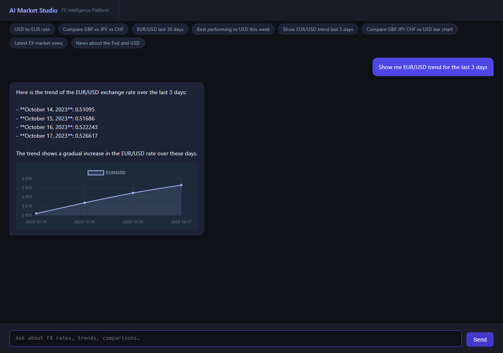

# AI Market Studio - Backend API

Backend API for the AI Market Studio conversational FX market data platform.

## Architecture

This is the backend component of a microservices architecture:
- **Backend API**: This repository (FastAPI)
- **Frontend UI**: [ai-market-studio-ui](https://github.com/gjnzsu/ai-market-studio-ui) (Static HTML/JS)
- **RAG Service**: [ai-rag-service](https://github.com/gjnzsu/ai-rag-service) (Research document query)

> **Vision:** AI-native market intelligence platform for natural language-driven data retrieval, automated dashboard generation, and context-aware insights.


---

## Features

### Feature 01 - FX Chat Assistant
- Natural-language queries: *"What is EUR/USD today?"*, *"Compare USD vs JPY and CHF"*
- GPT-4o function calling for FX rates, historical rates, dashboards, market news, and internal research
- Conversation history maintained client-side

### Feature 02 - FX Rate Historical Data
- `POST /api/rates/historical` - daily FX rates with in-memory LRU cache (TTL=300s)
- `POST /api/dashboard` - batch panel data fetch (up to 9 panels)
- Supports line trend, bar comparison, and stat summary panel types
- Toggle between live API and mock data via `USE_MOCK_CONNECTOR`

### Feature 03 - Market News
- Ask in natural language: *"What's the latest FX news?"*, *"Any news on EUR/USD?"*
- GPT-4o calls the `get_fx_news` tool; results render as inline news cards in the chat bubble
- Free RSS feeds (BBC Business, Investing.com FX, FXStreet); no paid news API key required
- Query filtering and item cap; fully decoupled from the rate connector via `USE_MOCK_NEWS_CONNECTOR`
- Mock news connector used in tests for deterministic output

### Feature 04 - Conversational Dashboard Generation
- Ask in natural language: *"Show me EUR/USD and GBP/USD trend for the last 5 days"*
- LLM detects chart/visualize/show intent and calls the `generate_dashboard` tool
- Inline Chart.js chart renders directly inside the chat bubble; no tab switching
- Supports line-trend and bar-comparison chart types



### Feature 05 - Research Report RAG Query
- Ask in natural language: *"Search internal research docs for deployment checklist"*, *"Find internal research about RAG ingestion"*
- GPT-4o calls the `get_internal_research` tool, which queries the external RAG service configured by `RAG_SERVICE_URL`
- `RAGConnector` normalizes service responses into `{type: "rag", answer, sources[]}` so the chat UI can render cited source names inline
- Source names are derived from `title` first, then `document_id`, while preserving source metadata such as `source_type`, `excerpt`, and `score`
- Research-report/PDF ingestion is handled by the external RAG service; this repo currently provides the query and citation UI layer

### Feature 07 - Market Insight Summary
- Ask in natural language: *"Give me a market insight on EUR/USD and GBP/USD"*
- GPT-4o calls `generate_market_insight` to fetch spot rates and RSS news in one turn
- Batched API calls: all pairs with a shared target currency are fetched in a single request
- Renders inline rate chips and news cards inside the chat bubble


---

## Architecture

```text
Frontend (ai-market-studio-ui)
   |
   v
Backend API (this repo - FastAPI)
   |-- /api/chat              -> GPT-4o agent loop
   |-- /api/rates/historical  -> daily FX rates, LRU cached
   |-- /api/dashboard         -> batch panel fetch
   |
   v
Connector Layer
   |-- ExchangeRateHostConnector -> live FX data (exchangerate.host)
   |-- MockConnector             -> deterministic synthetic FX data
   |-- RSSNewsConnector          -> free RSS feeds
   |-- MockNewsConnector         -> deterministic synthetic news
   `-- RAGConnector              -> external RAG service (ai-rag-service)
```

**GPT-4o tools:** `get_exchange_rate`, `get_exchange_rates`, `get_historical_rates`, `generate_dashboard`, `get_fx_news`, `generate_market_insight`, `get_internal_research`

---

## Live Deployment

The backend API is deployed on Google Kubernetes Engine (GKE):

**Backend API:** Internal service (accessed via frontend)
**Frontend UI:** http://35.224.3.54/

| Detail | Value |
|---|---|
| Cluster | `helloworld-cluster` (us-central1) |
| GCP Project | `gen-lang-client-0896070179` |
| Backend Image | `gcr.io/gen-lang-client-0896070179/ai-market-studio:latest` |
| Frontend Image | `gcr.io/gen-lang-client-0896070179/ai-market-studio-ui:latest` |
| FX Connector | `USE_MOCK_CONNECTOR=true` in the current ConfigMap; set `false` for live exchangerate.host data |
| RAG Service | `http://ai-rag-service:8000` (internal Kubernetes service) |

---

## Quick Start

### Prerequisites
- Python 3.12+
- An [OpenAI API key](https://platform.openai.com/)
- An [exchangerate.host API key](https://exchangerate.host/) if you want live FX data
- Access to a deployed RAG service that supports `POST /query` with `{"question": "..."}`

### 1. Clone and install

```bash
git clone https://github.com/gjnzsu/ai-market-studio.git
cd ai-market-studio
pip install -r backend/requirements.txt
```

### 2. Configure environment

Create a `.env` file in the repo root:

```env
OPENAI_API_KEY=sk-...
EXCHANGERATE_API_KEY=your_key_here
USE_MOCK_CONNECTOR=true
USE_MOCK_NEWS_CONNECTOR=true
RAG_SERVICE_URL=http://34.10.130.210
```

> The exchangerate.host free tier has a low request quota. Keep `USE_MOCK_CONNECTOR=true` during development unless you specifically need live FX data.

### 3. Start the backend API

```bash
uvicorn backend.main:app --host 0.0.0.0 --port 8000
```

The API will be available at [http://localhost:8000](http://localhost:8000).

### 4. Start the frontend (separate repo)

Clone and run the frontend:

```bash
git clone https://github.com/gjnzsu/ai-market-studio-ui.git
cd ai-market-studio-ui
# Update API_BASE_URL in index.html or use environment config
python -m http.server 8080
```

Open [http://localhost:8080](http://localhost:8080) in your browser.

### 4. Test RAG from the UI

Try prompts such as:

```text
Search internal research docs for deployment checklist
Find internal research about RAG ingestion
```

If the RAG tool is selected, the assistant response should include a **Sources** block listing matched documents.

> **Note:** The frontend UI is in a separate repository. See [ai-market-studio-ui](https://github.com/gjnzsu/ai-market-studio-ui) for frontend setup.

---

## RAG Service Integration

### Query flow
1. The user asks a research-document question in `/api/chat`.
2. GPT-4o selects `get_internal_research`.
3. `backend/connectors/rag_connector.py` sends `POST {RAG_SERVICE_URL}/query` with `{"question": "..."}`.
4. The connector normalizes the service response to `type="rag"`, `answer`, and `sources[].name`.
5. `frontend/index.html` renders the answer and source list in the assistant chat bubble.

### Research report ingestion
- Ingest PDFs/research reports into the external RAG service before querying from AI Market Studio.
- In the current GCP setup, the app points to the deployed RAG endpoint at `http://34.10.130.210`.
- First-party PDF upload/ingestion endpoints and UI are not yet exposed in this repository; ingestion is owned by the external RAG service.

---

## Deploy to GKE

### 1. Build and push the image

```bash
gcloud auth configure-docker
docker build -t gcr.io/<PROJECT_ID>/ai-market-studio:latest .
docker push gcr.io/<PROJECT_ID>/ai-market-studio:latest
```

### 2. Get cluster credentials

```bash
gcloud container clusters get-credentials <CLUSTER_NAME> --region <REGION> --project <PROJECT_ID>
```

### 3. Create the Kubernetes secret

```bash
kubectl create secret generic ai-market-studio-secrets \
  --from-literal=OPENAI_API_KEY=<your-openai-key> \
  --from-literal=EXCHANGERATE_API_KEY=<your-key-or-dummy>
```

### 4. Configure RAG endpoint

Update `k8s/configmap.yaml`:

```yaml
RAG_SERVICE_URL: "http://34.10.130.210"
```

### 5. Apply manifests and restart the deployment

```bash
kubectl apply -f k8s/configmap.yaml
kubectl apply -f k8s/deployment.yaml
kubectl apply -f k8s/service.yaml
kubectl rollout restart deployment/ai-market-studio
kubectl rollout status deployment/ai-market-studio --timeout=300s
```

### 6. Get the external IP

```bash
kubectl get service ai-market-studio -o wide
```

---

## Configuration

| Variable | Default | Description |
|---|---|---|
| `OPENAI_API_KEY` | required | OpenAI API key |
| `OPENAI_MODEL` | `gpt-4o` | Model used by the agent |
| `EXCHANGERATE_API_KEY` | required | exchangerate.host API key |
| `USE_MOCK_CONNECTOR` | `false` | Use synthetic FX data instead of live exchangerate.host API |
| `USE_MOCK_NEWS_CONNECTOR` | `false` | Use synthetic news data instead of live RSS feeds |
| `RAG_SERVICE_URL` | `http://localhost:8000` | Base URL of the external RAG service; `RAGConnector` calls `POST {RAG_SERVICE_URL}/query` |
| `MAX_HISTORICAL_DAYS` | `7` | Max date range per dashboard request |
| `CORS_ORIGINS` | `*` | Comma-separated allowed origins |

---

## Running Tests

```bash
# Unit and E2E API tests
python -m pytest backend/tests/ -v

# RAG connector + chat integration tests
python -m pytest backend/tests/unit/test_rag_connector.py backend/tests/e2e/test_rag_integration.py -q

# Playwright end-to-end test (requires server running on :8000)
python test_dashboard.py
```

> Most automated tests use `MockConnector` or mocked RAG HTTP responses so they do not consume external API quota.

---

## Project Structure

```text
ai-market-studio/ (Backend API)
|-- backend/
|   |-- main.py
|   |-- router.py
|   |-- models.py
|   |-- config.py
|   |-- cache.py
|   |-- agent/
|   |   |-- agent.py
|   |   `-- tools.py
|   |-- connectors/
|   |   |-- base.py
|   |   |-- exchangerate_host.py
|   |   |-- mock_connector.py
|   |   |-- news_connector.py
|   |   `-- rag_connector.py
|   `-- tests/
|       |-- unit/
|       `-- e2e/
|-- docs/
|-- k8s/
|-- Dockerfile
`-- .env
```

**Related Repositories:**
- Frontend: [ai-market-studio-ui](https://github.com/gjnzsu/ai-market-studio-ui)
- RAG Service: [ai-rag-service](https://github.com/gjnzsu/ai-rag-service)

---

## Roadmap

| Priority | Theme | Features |
|---|---|---|
| P0 - Done | Foundation | Chat assistant, spot and historical FX rates, conversational dashboard, market news, GKE deployment, market insight summary |
| P1 - Awareness | Market Intelligence | Market insight summary and market news |
| P2 - Productivity | Output Generation | PPT / Excel / PDF report generation, email delivery of insights and reports |
| P3 - Intelligence | Research | Web search integration, deeper RAG workflows over internal documents, first-party report ingestion UI/API |
| P4 - Data Breadth | Data & Collaboration | Multi-source market data connectors, sales/trader commentary capture, scheduled reports |
| P5 - Advanced | Platform & Simulation | Custom agent creation, OCR/document ingestion for scanned PDFs, paper-trading simulation |
| P6 - Execution & Risk | Live Trading | Broker connectivity, pre-trade risk checks, account permissions, audit logs, kill switch controls |

> Recommendation: keep P5 simulation-only. Add live FX execution in P6 only after authentication, RBAC, audit logging, and pre-trade risk controls are in place.
