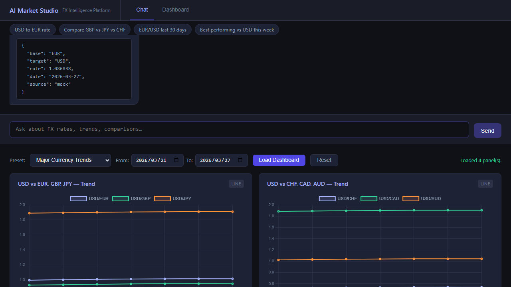

# AI Market Studio

A conversational FX market data platform. Ask natural-language questions about exchange rates and explore historical trends through an interactive dashboard — all in a single-page app with no build step.

> **Vision:** AI-native market intelligence platform that enables natural language–driven data retrieval, automated dashboard generation, and context-aware insights.



---

## Features

### Feature 01 — FX Chat Assistant
- Natural-language queries: *"What is EUR/USD today?"*, *"Compare USD vs JPY and CHF"*
- GPT-4o function calling with three tools: spot rate, multi-pair rates, supported currencies list
- Conversation history maintained client-side

### Feature 02 — FX Rate Trend Dashboard
- 5 built-in presets: Major Currency Trends, Asia-Pacific, EUR Cross Rates, Volatility Focus, Custom
- Three panel types: line trend chart, bar comparison chart, stat summary
- Date range picker (default: last 7 days)
- In-memory LRU cache (TTL=300s) — shared across panels in a single request
- Toggle between live API and mock data via env var

---

## Architecture

```
Browser (Vanilla JS + Chart.js)
        │
        ▼
FastAPI Backend  (backend/)
   ├── /api/chat              ← GPT-4o agent loop
   ├── /api/rates/historical  ← daily FX rates, cached
   └── /api/dashboard         ← batch panel fetch
        │
        ▼
Connector Layer
   ├── ExchangeRateHostConnector  ← live data (exchangerate.host)
   └── MockConnector              ← deterministic synthetic data
```

---

## Live Deployment

The app is deployed on Google Kubernetes Engine (GKE):

**http://35.224.3.54/**

| Detail | Value |
|---|---|
| Cluster | `helloworld-cluster` (us-central1) |
| GCP Project | `gen-lang-client-0896070179` |
| Image | `gcr.io/gen-lang-client-0896070179/ai-market-studio:latest` |
| Connector | `USE_MOCK_CONNECTOR=true` |

---

## Quick Start

### Prerequisites
- Python 3.12+
- An [OpenAI API key](https://platform.openai.com/)
- An [exchangerate.host API key](https://exchangerate.host/) (free tier)

### 1. Clone and install

```bash
git clone https://github.com/gjnzsu/ai-market-studio.git
cd ai-market-studio
pip install -r backend/requirements.txt
```

### 2. Configure environment

Create a `.env` file in the repo root:

```env
OPENAI_API_KEY=sk-...
EXCHANGERATE_API_KEY=your_key_here
USE_MOCK_CONNECTOR=true   # set false to use live exchangerate.host data
```

> **Note:** The exchangerate.host free tier has a ~100 req/month quota. Keep `USE_MOCK_CONNECTOR=true` during development to avoid exhausting it.

### 3. Start the server

```bash
uvicorn backend.main:app --host 0.0.0.0 --port 8000
```

Open [http://localhost:8000](http://localhost:8000) in your browser.

---

## Deploy to GKE

### Prerequisites
- [Docker](https://docs.docker.com/get-docker/) with GCR auth configured
- [gcloud CLI](https://cloud.google.com/sdk/docs/install) authenticated
- `kubectl` configured for your cluster

### 1. Build and push the image

```bash
gcloud auth configure-docker
docker build -t gcr.io/<PROJECT_ID>/ai-market-studio:latest .
docker push gcr.io/<PROJECT_ID>/ai-market-studio:latest
```

### 2. Get cluster credentials

```bash
gcloud container clusters get-credentials <CLUSTER_NAME> --region <REGION> --project <PROJECT_ID>
```

### 3. Create the Kubernetes secret

```bash
kubectl create secret generic ai-market-studio-secrets \
  --from-literal=OPENAI_API_KEY=<your-openai-key> \
  --from-literal=EXCHANGERATE_API_KEY=<your-key-or-dummy>
```

> Do not commit real API keys to `k8s/secret.yaml`. Always create secrets imperatively.

### 4. Apply manifests

```bash
kubectl apply -f k8s/configmap.yaml
kubectl apply -f k8s/deployment.yaml
kubectl apply -f k8s/service.yaml
```

### 5. Get the external IP

```bash
kubectl get service ai-market-studio --watch
```

Once `EXTERNAL-IP` is assigned, the app is available at `http://<EXTERNAL-IP>/`.

---

## Configuration

| Variable | Default | Description |
|---|---|---|
| `OPENAI_API_KEY` | — | Required. OpenAI API key |
| `OPENAI_MODEL` | `gpt-4o` | Model used by the agent |
| `EXCHANGERATE_API_KEY` | — | Required. exchangerate.host API key |
| `USE_MOCK_CONNECTOR` | `false` | Use synthetic data instead of live API |
| `MAX_HISTORICAL_DAYS` | `7` | Max date range per dashboard request |
| `CORS_ORIGINS` | `*` | Comma-separated allowed origins |

---

## Running Tests

```bash
# Unit and E2E API tests
pytest backend/tests/ -v

# Playwright end-to-end test (requires server running on :8000)
python test_dashboard.py
```

> Tests always use `MockConnector` — no API quota consumed.

---

## Project Structure

```
ai-market-studio/
├── backend/
│   ├── main.py              # FastAPI app factory
│   ├── router.py            # API endpoints
│   ├── models.py            # Pydantic request/response models
│   ├── config.py            # Settings (pydantic-settings)
│   ├── cache.py             # In-memory LRU rate cache
│   ├── agent/
│   │   ├── agent.py         # GPT-4o function-calling loop
│   │   └── tools.py         # Tool definitions and dispatch
│   ├── connectors/
│   │   ├── base.py          # Abstract connector interface
│   │   ├── exchangerate_host.py
│   │   └── mock_connector.py
│   └── tests/
│       ├── unit/
│       └── e2e/
├── frontend/
│   └── index.html           # Single-page app (no build step)
├── docs/                    # Design and product documentation
├── test_dashboard.py        # Playwright E2E test
└── .env                     # Local secrets (not committed)
```

---

## Roadmap

- [x] Feature 01 — Chat assistant with GPT-4o function calling
- [x] Feature 02 — FX Rate Trend Dashboard
- [ ] Feature 03 — localStorage persistence, authentication, CORS lockdown
- [x] Feature 04 — Conversational dashboard control via GPT-4o
- [ ] Feature 05 — Paid-tier API integration (intraday data, higher quota)
