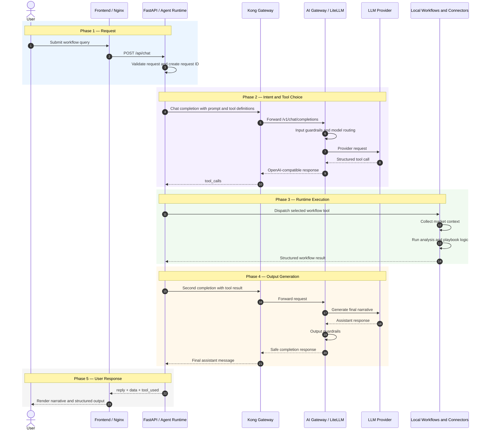

# Use Case: End-to-End User Workflow Request Call Chain

## Purpose

This document explains how a single user workflow request moves through AI Market Studio, from the browser to the backend agent runtime, through the LLM gateway path, into local workflow execution, and back to the user.

The most useful mental model is:

```text
First LLM call: decide what to do
        ↓
Agent runtime: execute the selected workflow and tools
        ↓
Second LLM call: turn the results into a user-facing response
```

The LLM is responsible for intent interpretation, tool selection, and natural-language generation. The agent runtime is responsible for orchestration, connector execution, conversation state, structured results, timeouts, and error handling.

## Example Use Case

**User request:**

> Analyze the EUR/USD rate differential and market outlook.

**Expected outcome:**

- The model selects the appropriate intent-level workflow.
- The runtime collects relevant FX, news, FRED, and research data.
- The runtime applies the selected financial playbook and deterministic analysis.
- The model generates a concise, grounded narrative.
- The frontend receives both the narrative and structured workflow data.

## End-to-End Sequence



## Phase 1: The User Request Enters the Backend API

The frontend sends a request similar to:

```http
POST /api/chat
Content-Type: application/json

{
  "message": "Analyze the EUR/USD rate differential and market outlook.",
  "history": [],
  "agent_mode": "workflow"
}
```

FastAPI registers the `/api` router in [`backend/main.py`](../backend/main.py), and the request enters the `/api/chat` handler in [`backend/router.py`](../backend/router.py).

The handler:

1. Validates the request with `ChatRequest`.
2. Loads conversation history and available connectors.
3. Creates or preserves a correlation request ID.
4. Enforces the workflow feature flag and request timeout.
5. Calls `run_agent(...)`.

### Public API boundary

There is currently no separate public API Gateway implemented in this repository. The deployed user-request path is:

```text
Browser → Frontend LoadBalancer → FastAPI Backend
```

Kong is used for outbound LLM traffic from the backend, not for the browser's `/api/chat` request.

## Phase 2: The Agent Runtime Requests an LLM Decision

The agent loop is implemented by `run_agent(...)` in [`backend/agent/agent.py`](../backend/agent/agent.py).

It builds the first model request from:

- The workflow system prompt.
- Previous conversation messages.
- The current user message.
- The available intent-level tool definitions.

Workflow mode exposes three model-facing tools from [`backend/agent/tools.py`](../backend/agent/tools.py):

- `collect_market_context`
- `analyze_market_context`
- `generate_market_briefing`

The runtime then makes an OpenAI-compatible call with automatic tool selection:

```python
response = await client.chat.completions.create(
    model=settings.openai_model,
    messages=messages,
    tools=tool_definitions,
    tool_choice="auto",
)
```

In GKE, the OpenAI client's base URL points to Kong:

```text
http://ai-gateway-kong.ai-gateway.svc.cluster.local/v1
```

The runtime also propagates correlation and business-attribution headers, including `X-Request-ID`, `X-Consumer-Service`, application, project, team, use-case, and feature identifiers.

## Phase 3: Kong and the AI Gateway Route the Model Request

The model traffic path is:

```text
Agent Runtime → Kong Gateway → AI Gateway Service → OpenAI or DeepSeek
```

### Kong Gateway responsibilities

Kong provides the network routing and basic gateway policy layer:

- Routes `/v1/chat/completions` to `ai-gateway-service`.
- Generates or propagates `X-Request-ID`.
- Applies rate limiting.
- Returns upstream status and transport errors to the backend.

The declarative route is configured in [`k8s/kong-config.yaml`](../k8s/kong-config.yaml).

### AI Gateway responsibilities

The independent `ai-gateway-service` provides the semantic LLM gateway layer:

- OpenAI-compatible API handling.
- Provider credentials and model routing.
- OpenAI and DeepSeek provider selection based on model name.
- PII detection or masking.
- Prompt safety policy.
- Response safety policy.
- Token, cost, latency, and guardrail observability.

The AI Gateway implementation lives in a separate repository. This repository contains its client configuration, Kong route, error contract, and integration documentation.

## Phase 4: LLM Reasoning and Planning

The current runtime does not have a separate `PlannerAgent` or a persisted plan object. Planning is implicit in the first model call and becomes visible as a structured tool call.

For the example request, the model might return:

```json
{
  "name": "generate_market_briefing",
  "arguments": {
    "pairs": ["EUR/USD"],
    "playbook": "fx_carry",
    "include_news": true,
    "include_fred": true,
    "include_research": true
  }
}
```

Conceptually:

```text
Model-internal reasoning
        ↓
Select an intent-level workflow
        ↓
Produce structured tool arguments
```

The model's private chain of thought is neither requested nor returned. The runtime receives only the actionable result: a tool name and JSON arguments.

## Phase 5: The Agent Runtime Executes the Workflow

When the model response has `finish_reason="tool_calls"`, the agent runtime parses the arguments and invokes `dispatch_tool(...)`.

For `generate_market_briefing`, the local execution path is:

```text
generate_market_briefing
├── select_playbook
├── collect_market_context
│   ├── FX rates connector
│   ├── News connector
│   ├── FRED connector
│   └── RAG connector
├── analyze_market_context
├── build optional synthetic specialist data
└── assemble the structured briefing
```

The workflow implementation is in [`backend/agent/workflows.py`](../backend/agent/workflows.py).

### Important traffic boundary

The local workflow connectors do not currently pass through Kong or the AI Gateway:

```text
LLM completions → Kong and AI Gateway
Workflow tools   → Local connectors and configured data services
```

Current tool-side integrations include FX data, news, FRED, and RAG. They are only gateway-mediated if they are explicitly moved behind `ai-gateway-service` in the future.

### Analysis behavior

The workflow's trend and volatility calculations are currently deterministic Python operations in [`backend/agents/market_analyst.py`](../backend/agents/market_analyst.py). They are not additional hidden LLM calls.

This separation gives the runtime a stable structured result while reserving the LLM for intent interpretation and narrative synthesis.

## Phase 6: The LLM Generates the Final Output

After tool execution, the agent runtime:

1. Retains the complete result as `last_tool_data` for the frontend.
2. Creates a compact summary of the tool result for the model.
3. Appends the summary as a `role: tool` message.
4. Makes another chat-completion request through the same gateway path.

The second model call normally returns `finish_reason="stop"` and the final natural-language response. The AI Gateway applies response safety policy before returning that completion.

The agent runtime then returns:

```json
{
  "reply": "The final natural-language market analysis...",
  "data": {
    "type": "market_briefing",
    "context": {},
    "analysis": {},
    "source_grounding": {},
    "data_gaps": []
  },
  "tool_used": "generate_market_briefing"
}
```

FastAPI validates this as `ChatResponse` and sends it to the frontend for rendering.

## Round and Timeout Controls

Workflow execution is bounded by two controls:

- `AGENT_WORKFLOW_TIMEOUT_SECONDS` limits the complete `/api/chat` workflow.
- `AGENT_WORKFLOW_MAX_ROUNDS` limits the number of model/tool loop iterations.

The deployed configuration currently permits two rounds, which supports the expected pattern of one tool-selection response followed by one final narrative response.

If the round limit is reached after structured workflow data has already been collected, the runtime returns a deterministic fallback reply derived from that data instead of calling the model indefinitely.

## Error and Safety Behavior

The backend maps failures into user-safe API responses:

| Failure | API behavior |
| --- | --- |
| Complete workflow timeout | `504` request timeout |
| Kong or AI Gateway timeout | `504` AI gateway timeout |
| Gateway connection or upstream failure | `503` AI gateway unavailable |
| Prompt safety violation | `400` sanitized prompt rejection |
| Response safety violation | `502` sanitized response block |
| Local market-data connector failure | `503` market data unavailable |
| Unexpected runtime failure | `500` internal server error |

Raw blocked content is not returned to the frontend.

## Key Implementation References

| Concern | Location |
| --- | --- |
| FastAPI application and router registration | [`backend/main.py`](../backend/main.py) |
| `/api/chat` endpoint and error mapping | [`backend/router.py`](../backend/router.py) |
| Request and response schemas | [`backend/models.py`](../backend/models.py) |
| Agent loop and LLM calls | [`backend/agent/agent.py`](../backend/agent/agent.py) |
| Model-facing tools and dispatch | [`backend/agent/tools.py`](../backend/agent/tools.py) |
| Workflow orchestration | [`backend/agent/workflows.py`](../backend/agent/workflows.py) |
| Deterministic market analysis | [`backend/agents/market_analyst.py`](../backend/agents/market_analyst.py) |
| Correlation and attribution headers | [`backend/attribution.py`](../backend/attribution.py) |
| Runtime configuration | [`backend/config.py`](../backend/config.py) |
| GKE runtime values | [`k8s/configmap.yaml`](../k8s/configmap.yaml) |
| Kong routing and plugins | [`k8s/kong-config.yaml`](../k8s/kong-config.yaml) |
| Gateway traffic boundary | [`gateway-tool-traffic-boundaries.md`](gateway-tool-traffic-boundaries.md) |

## Summary

For one workflow request, the expected production path is:

```text
User
  → Frontend
  → FastAPI / Agent Runtime
  → Kong
  → AI Gateway
  → LLM selects a workflow tool
  → Agent Runtime executes local workflows and connectors
  → Kong
  → AI Gateway
  → LLM generates the final narrative
  → Agent Runtime returns reply + structured data + tool_used
  → Frontend renders the result
```

The central architectural distinction is that the gateways govern model traffic, while the agent runtime owns business workflow execution.
